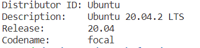
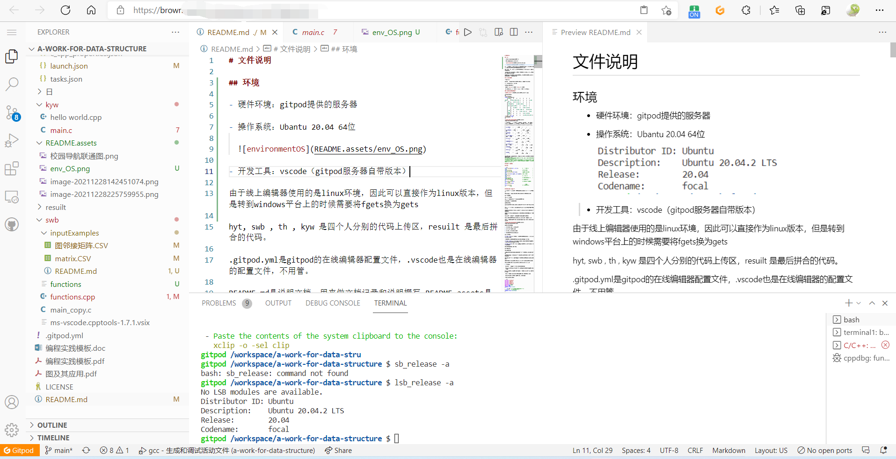
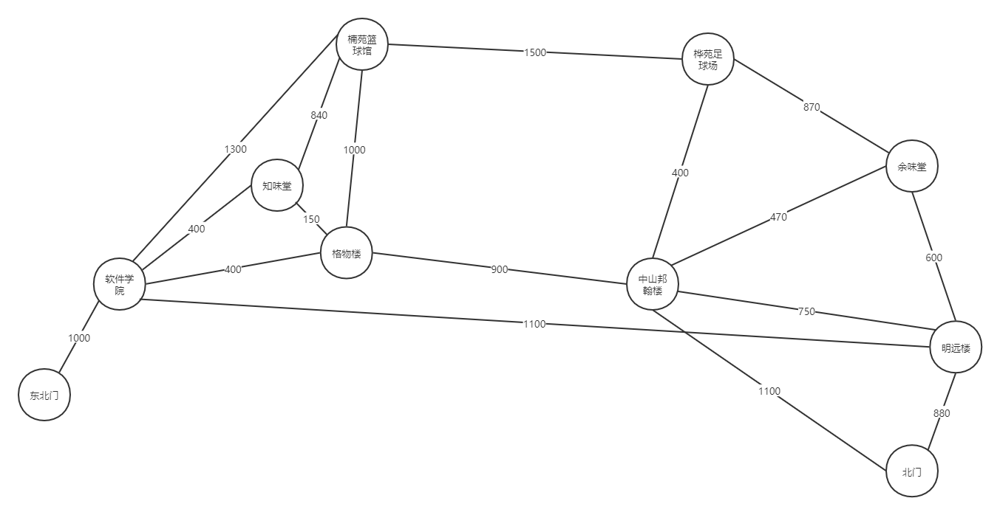
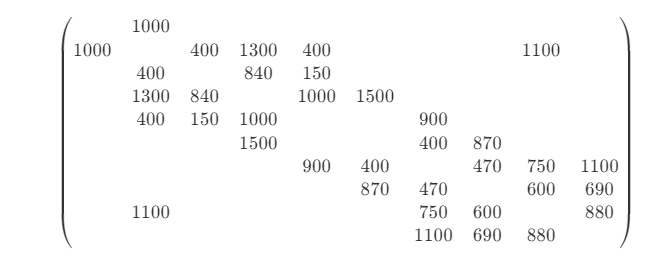
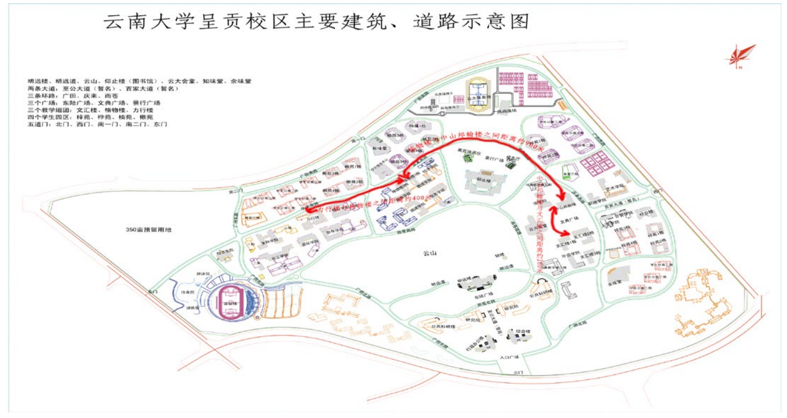

# README

## 环境

- 硬件环境：gitpod提供的服务器

- 操作系统：Ubantu 20.04 64位
  
  

- 开发工具：VSCode（gitpod服务器自带）
  
  

- 运行环境:WINDOWS操作系统\LINUX操作系统

由于线上编辑器使用的是linux环境，因此可以直接作为linux版本，但是转到windows平台上的时候需要将fgets换为gets

## 文件说明

hyt, swb , th , kyw 是四个人分别的代码上传区，resuilt 是最后拼合的代码。

.gitpod.yml是gitpod的在线编辑器配置文件，.vscode也是在线编辑器的配置文件，不用管。

README.md是说明文档，用来做文档记录和说明撰写,README.assets是存储README中图片的文件夹。

## 选用10个地点

图的建立：

两个点加一条边的长度，直接写在代码里, 不需要再手动输入

在开头直接展示距离和起始点

打印(向用户展现)：

 A地点 --[距离]--> B地点 --[距离]--> C地点

 输出样例：力行楼 --400--> 格物楼 --900-->中山邦翰楼

### 由这10个地点构成的图



对应的邻接矩阵:
$$
\begin{align*}
\left(\begin{matrix}
     & 1000 &     &      &      &      &      &     &      &      \\
1000 &      & 400 & 1300 & 400  &      &      &     & 1100 &      \\
     & 400  &     & 840  & 150  &      &      &     &      &      \\
     & 1300 & 840 &      & 1000 & 1500 &      &     &      &      \\
     & 400  & 150 & 1000 &      &      & 900  &     &      &      \\
     &      &     & 1500 &      &      & 400  & 870 &      &      \\
     &      &     &      & 900  & 400  &      & 470 & 750  & 1100 \\
     &      &     &      &      & 870  & 470  &     & 600  & 690  \\
     & 1100 &     &      &      &      & 750  & 600 &      & 880  \\
     &      &     &      &      &      & 1100 & 690 & 880  &
\end{matrix}\right)
\end{align*}   \\
$$



空着的位置表示没有连接，在邻接矩阵的二维数组里填入-1

| (邻接矩阵)     | 东北门 | 软件学院 | 知味堂 | 楠苑篮球馆 | 格物楼 | 桦苑足球场 | 中山邦翰楼 | 余味堂 | 明远楼 | 北门 |
| -------------- | ------ | -------- | ------ | ---------- | ------ | ---------- | ---------- | ------ | ------ | ---- |
| **东北门**     |        | 1000     |        |            |        |            |            |        |        |      |
| **软件学院**   | 1000   |          | 400    | 1300       | 400    |            |            |        | 1100   |      |
| **知味堂**     |        | 400      |        | 840        | 150    |            |            |        |        |      |
| **楠苑篮球馆** |        | 1300     | 840    |            | 1000   | 1500       |            |        |        |      |
| **格物楼**     |        | 400      | 150    | 1000       |        |            | 900        |        |        |      |
| **桦苑足球场** |        |          |        | 1500       |        |            | 400        | 870    |        |      |
| **中山邦翰楼** |        |          |        |            | 900    | 400        |            | 470    | 750    | 1100 |
| **余味堂**     |        |          |        |            |        | 870        | 470        |        | 600    | 690  |
| **明远楼**     |        | 1100     |        |            |        |            | 750        | 600    |        | 880  |
| **北门**       |        |          |        |            |        |            | 1100       | 690    | 880    |      |

可能问题:因为软院到知味堂和软院到格物楼的距离相等问题导致的可能最短路径存在多条
<!--可改进：对称矩阵可压缩存储，目前先使用最简单的完整存储数组的方式（2021.12.28）-->
<!--可改进：可以通过读取文本文件来生成图，方便日后修改地图，如上文本———后期版本，可以通过读取文本文件的方式来生成图，读取文件的文本格式暂定为-->

## 存入图中的数据

## 分工

```c++
void CreateUDN(int v, int a);        /* 造图函数 */        //swb
void narrate();                      /*说明函数*/          //swb 把图打出来
void ShortestPath(int num);          /*最短路径函数*/      //th  
void output(int sight1, int sight2); /*输出函数*/          //swb
char Menu();                         /* 主菜单 */          //swb
void search();                       /* 查询建筑信息 */    //介绍建筑信息 swb
char SearchMenu();                   /* 查询子菜单 */          //swb
void HaMiTonian(int);                /* 哈密尔顿图的遍历 */    //kyw
void NextValue(int);                                          //kyw
void display();                      /* 显示遍历结果 */        //kyw
```

## 数据结构实验指导书

图是本门课程所涉及的另一种重要的数据结构。本实验继续训练学生在理解

数据结构特性基础上，灵活运用数据结构解决实际问题的能力。

【基本要求】

1、熟悉图结构。

2、掌握图的存储以及图形结构上的各种操作。

3、学会运用图结构求解问题

【问题描述】

根据云南大学呈贡校区主要道路建筑示意图（见下图，可放大），以已标出

的距离为参照，测量出主要建筑（教学楼、办公楼、食堂、学生宿舍、运动场、

乘车点等）之间的路程（距离）。以图为工具，建立模型，求解不同难度的问题。

要求能够回答有关建筑介绍、游览路径等问题。用户（师生）通过终端可询问：

（1）从某一建筑到另一建筑的最短路径。(最短路径问题)

（2）用户从校园某处（由用户选定）进入，选取一条最佳路线。

（3）使用户可以不重复地浏览各建筑，最后回到出口（出口就在入口旁边）。



【CDIO 项目要求】

1. 有完整的 CDIO 四个阶段描述

2. 有友好美观的操作界面

3. 有软件使用说明或帮助文档

4. 项目成员分工明确，团结协作

【实验内容】

**难度** **A**：用图来表示一个校园内各种地名（不少于 10 个），及其相对位置，

实现校园内主要地点的遍历。个人完成，评分最高 70 分。

**难度** **B**：在 A 的基础上，能求解任意两个地点之间的最短距离。个人完成，评分最高 90 分。

**难度** **C**：实现一个能为新生指路的校园自动导游程序。由 2-3 个人的团队完

成，评分最高可至 100 分。

【实现提示】

（1）问题解析

用无向网表示校区内的各建筑的平面图，图中顶点表示主要建筑，存放建筑

的编号、名称、简介等信息，图中的边表示建筑间的道路，存放路径长度等信息。

（2）将导游图看作一张带权无向图，顶点表示校园的各个建筑，边表示各建

筑之间的道路，边上的权值表示距离，为此图选择适当的数据结构。

（3）把各种路径都显示给用户，由用户自己选择浏览路线。

1. 算法提示

 （1）构造一个无向图 G 并用邻接矩阵来存储。

 （2）利用迪杰斯特拉算法来计算出起点到各个顶点之间的最短路径用二维数

组 p[i][]来记 录，最短路径长度就用一维数组 d[i]存放；i 的范围：0～20。

 （3）一维数组 have[]可用来记录最短路径出现顶点的顺序。

 （4）根据起点和终点输出最短路径和路径长度。

参考程序结构及界面：

```c++
#include "string.h"
#include "stdio.h"
#include "stdio.h"
#include "malloc.h"
#include "stdlib.h"
#define Max 20000
#define NUM 9
typedef struct ArcCell
{
    int adj; /* 相邻接的建筑之间的路程 */
} ArcCell;   /* 定义边的类型 */
typedef struct VertexType
{
    int number;        /* 建筑编号 */
    char *sight;       /* 建筑名称 */
    char *description; /* 建筑描述 */
} VertexType;          /* 定义顶点的类型 */
typedef struct
{
    VertexType vex[NUM];    /* 图中的顶点，即为建筑 */
    ArcCell arcs[NUM][NUM]; /* 图中的边，即为建筑间的距离 */
    int vexnum, arcnum;     /* 顶点数，边数 */
} MGraph;                   /* 定义图的类型 */
MGraph G;                   /* 把图定义为全局变量 */
int P[NUM][NUM];            /* */
long int D[NUM];            /* 辅助变量存储最短路径长度 */
int x[9] = {0};         /* ？？猜测是9条边？？ */
void CreateUDN(int v, int a);        /* 造图函数 */
void narrate();                      /*说明函数*/
void ShortestPath(int num);          /*最短路径函数*/
void output(int sight1, int sight2); /*输出函数*/
char Menu();                         /* 主菜单 */
void search();                       /* 查询建筑信息 */
char SearchMenu();                   /* 查询子菜单 */
void HaMiTonian(int);                /* 哈密尔顿图的遍历 */
void NextValue(int);
void display(); /* 显示遍历结果 */
void main()     /* 主函数 */
{
    int v0, v1;
    char ck;
    system("color fc");
    CreateUDN(NUM, 11);
    do
    {
        ck = Menu();
        switch (ck)
        {
        case '1':
            system("cls");
            narrate();
            printf("\n\n\t\t\t 请选择起点建筑（0～8）：");
            scanf("%d", &v0);
            printf("\t\t\t 请选择终点建筑（0～8）：");
            scanf("%d", &v1);
            ShortestPath(v0); /* 计算两个建筑之间的最短路径 */
            output(v0, v1);   /* 输出结果 */
            printf("\n\n\t\t\t\t 请按任意键继续...\n");
            getchar();
            getchar();
            break;
        case '2':
            search();
            break;
        case '3':
            system("cls");
            narrate();
            x[0] = 1;
            HaMiTonian(1);
            printf("\n\n\t\t\t\t 请按任意键继续...\n");
            getchar();
            getchar();
            break;
        };
    } while (ck != 'e');
}
char Menu() /* 主菜单 */
{
    char c;
    int flag;
    do
    {
        flag = 1;
        system("cls");
        narrate();
        printf("\n\t\t\t┏━━━━━━━━━━━━━━━━━━━━━━┑\n");
        printf(  "\t\t\t┃                      ┃\n");
        printf(  "\t\t\t┃ 1、查询建筑路径       ┃\n");
        printf(  "\t\t\t┃ 2、查询建筑信息       ┃\n");
        printf(  "\t\t\t┃ 3、选择出发点和目的地  ┃\n");
        printf(  "\t\t\t┃ e、退出               ┃\n");
        printf(  "\t\t\t┃                      ┃\n");
        printf(  "\t\t\t┗━━━━━━━━━━━━━━━━━━━━━━┛\n");
        printf(  "\t\t\t\t 请输入您的选择：");
        scanf("%c", &c);
        if (c == '1' || c == '2' || c == '3' || c == 'e')
            flag = 0;
    } while (flag);
    return c;
}
```

**主要教学环节的组织：**

1、指导教师说明实验目的，布置实验项目。

2、学生上机编程实践。

3、指导教师验收学生的程序，简单评价并给出建议，必要情况下给出指导。

4、学生对实验进行总结，整理相关材料，完成实验报告。

**思考题：**

比较 Dijkstra 的最短路径算法与 Floyd 算法在问题求解中的效率。
